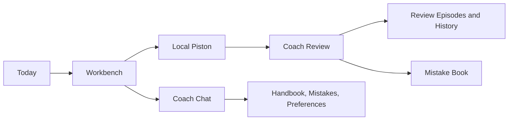

# PatternCoach AI

> **Your coding history should coach you back.**

PatternCoach AI is a local practice system for algorithm interview preparation. It connects real Python execution, focused coaching, review memory, study artifacts, and a goal-based daily plan—so an attempt can become evidence and context for what you practice next.

[Quick Start](#quick-start) · [See the Practice Loop](#one-practice-loop) · [Explore the Design](#built-beyond-a-chat-wrapper)

**150 Python Practice Contracts · Piston-Backed Evidence · Persistent Review Context · Permission-Gated Learning Writes · Goal-Based Today Plan**

## Why PatternCoach?

- **Stop repeating the same blind spot.** Keep the failed case, diagnosis, and draft together so you can revisit the reason—not just the rejected solution.
- **Get the next useful clue—not an instant solution.** Ask for one step, check an invariant, or trace a failure before rewriting everything.
- **Turn each attempt into future context.** Reviews, mistakes, and reusable notes stay available for later practice and configured Coach requests.

## What You Can Do

- **Focused Workbench** — Keep the problem link, Python editor, visible tests, run evidence, **Review My Code**, and **Coach Chat** in one working screen.
- **Evidence-Grounded Review** — Review executes the selected tests in local Piston, then examines the exact draft, status, output, and first failing case.
- **Progressive Coach** — Ask about the current draft or run, request one next step, test an invariant, or walk through the first failure before seeing more.
- **Today** — Turn a target date and weekly study time into a deterministic daily dose, then open the next catalog problem directly in the Workbench.
- **Mistake Book** — Convert failed Reviews or explicit saves into **Problems to Revisit**, preserving what failed and what to check on the next attempt.
- **Knowledge Handbook** — Capture transferable Python techniques and algorithm patterns; search, edit, copy, or export them when a similar problem appears.
- **Problem History & Skill Profile** — Revisit attempts and activity, then maintain the strengths, weaknesses, and learning preferences you want the Coach to know.

## Built Beyond a Chat Wrapper

- **The Coach executes before it advises.** **Review My Code** sends selected visible tests to local Piston, captures the first failure plus standard output or runtime errors, and stores that evidence with the Review. Advice starts from an observed run, not a pasted-code guess.
- **One inspectable Coach runtime.** The public release keeps teaching and persistence in a single foreground flow. Execution, recent Review context, response generation, and transactional writes can be followed end to end.
- **Persistent context, not a stateless prompt.** Every completed Review creates a durable episode and deterministic learning facts. When an external provider is configured, focused facts and recent episodes can inform later Reviews and chats without sending the full local history.
- **Controlled long-term writes.** Preferences, Knowledge Handbook notes, and Mistake Book entries are saved from Coach Chat only after an explicit user request. Durable learning state is intentional and traceable rather than inferred from every message.
- **Explicit orchestration.** The active path connects execution, evidence, history, and authorized learning writes through inspectable application services. Coach Chat uses a bounded tool loop for real code execution, focused retrieval, practice search, hints, and explicitly authorized learning writes.
- **Local learning state.** Drafts, runs, plans, chats, history, and study artifacts persist in the local app. External model context is sent only when the user configures a compatible provider.



For the compact technical map, see the [architecture overview](docs/architecture-overview.md).

## One Practice Loop

```text
Pick from Today or the catalog → Write and run Python → Review the evidence
→ Ask for one focused next step → Keep the Review in History
→ Save the mistake or reusable idea → Revisit it in a later session
```

The result of a session does not disappear into a chat transcript: its run evidence, Review episode, and intentionally saved learning artifacts remain available after the Workbench closes.

## Quick Start

Requires Node.js `^20.19.0`, `^22.12.0`, or `>=24.0.0`, plus npm, Docker, and Docker Compose. The setup script creates the local environment and database; Piston provides real Python execution.

```bash
git clone https://github.com/Iriss0904/personalized-leetcode-coach.git
cd personalized-leetcode-coach
```

Then run:

```bash
npm ci
npm run setup
npm run piston:up
npm run piston:smoke
npm run doctor
npm run dev
```

If the first Piston smoke specifically reports that Python 3.12.0 is missing, approve the one-time runtime download and retry:

```bash
npm run piston:install -- --confirm
npm run piston:smoke
npm run doctor
```

Open <http://localhost:3000>. The built-in local Coach needs no provider setup; an OpenAI-compatible provider is optional.

For Piston runtime setup, provider configuration, shutdown, and troubleshooting, see the [setup guide](docs/user-setup.md).

## Get More From Your Coach

- Ask for one hint and say what you already understand.
- Ask the Coach to trace the first failing visible test before suggesting a fix.
- Ask for the smallest next step that preserves your current approach.
- Add a boundary case before changing the algorithm.
- Use **Review My Code** when you want feedback grounded in a fresh real run.
- Explicitly save reusable ideas to the **Knowledge Handbook**.
- Explicitly save important failures to the **Mistake Book**.
- Reopen a **Problem to Revisit** before attempting a related pattern.

## Documentation

- [Setup guide](docs/user-setup.md)
- [User guide](docs/user-guide.md)
- [Troubleshooting](docs/troubleshooting.md)
- [Data and privacy](docs/privacy.md)
- [Architecture overview](docs/architecture-overview.md)

## Status, Privacy, and License

PatternCoach stores profiles, drafts, runs, chats, plans, history, mistakes, and notes locally. Code is executed by the configured Piston service. When you configure an external Coach, selected current context—including the request, draft, problem, focused learning records, and requested tool results—is sent to that provider. See the [privacy guide](docs/privacy.md) before enabling it.

<details>
<summary>Current v0.1 limitations</summary>

- Python only; the catalog includes 150/150 local Python contracts and independently authored visible-test sets.
- Visible tests are not official or hidden judge tests, and problem statements are linked rather than bundled.
- Docker and a healthy local Piston runtime are required for Run Code and Review My Code.
- Today schedules catalog work from the goal and available study time. Review self-ratings complete matching items, update deterministic review schedules, and feed Review Focus; open-ended Chat requests do not automatically rewrite the plan.
- Skill Profile preferences are editable, and real Reviews update deterministic skill/mistake facts and local synthesis. Public v0.1 does not use embedding or sqlite-vec retrieval.
- Public memory retrieval uses SQLite FTS5, focused deterministic facts, recent local episodes, and recent Chat turns; there is no background LLM consolidation service.
- Coach Chat dispatches the public bounded tool set. Durable Profile, Memory, Handbook, and Mistake Book writes require an explicit user request or confirmation.
- The built-in local Coach provides deterministic guidance; model-powered responses require your own compatible provider.

</details>

PatternCoach AI is licensed under [AGPL-3.0-only](LICENSE). See [NOTICE](NOTICE) for third-party and content notices. Local execution uses [Engineer Man Piston](https://github.com/engineer-man/piston), an independent project.

LeetCode and its problem titles are third-party content and trademarks. This project is not affiliated with or endorsed by LeetCode.
